

  
  <h2>Enatega Multi-vendor</h2>
  <i>Enatega is an open-source delivery management platform for the future.</i>
  
 

	

  
  
  
  
  
  
  
  
  

  
  
  
  

  

Our Enatega Multi-vendor food delivery solution is perfect for customers looking to deploy a readymade and easy to use platform for their food delivery and logistics business. Just like foodpanda and ubereats, our solution can incorporate multiple restaurants as well as restaurants that operate in multiple locations. With access to the admin panel and separate applications for customers and riders, you can use this solution to create your own foodpanda clone instantaneously.

<b>Our solution is open source but the backend and API are proprietary, and can be obtained via paid license.</b>

 

## Quick Links
 - [What is included](#heading-1)
 - [Features](#heading-2)
 - [Setup](#heading-3)
 - [Prerequisites](#heading-4)
 - [Technologies](#heading-5)
 - [Screenshots](#heading-6)
 - [High Level Architecture](#heading-7)
 - [Documentation and Demo Videos](#heading-8)
 - [Demos](#heading-9)
 - [Contributing](#heading-10)
 - [Star graph](#heading-11)
- [Contributors](#heading-14)
 - [Disclaimer](#heading-12)
 - [Contact Us](#heading-13)

 

 

## What is included: 

Our solution also comes with the following:

- Enatega Multivendor Customer App
- Enatega Multivendor Rider App
- Enatega Multivendor Restaurant App
- Customer Website
- Admin Web Dashboard
- Application Program interface Server
- Analytics Dashboard with Expo Amplitude
- Error crash reporting with Sentry

## Features: 

- Authentication using Google, Apple, and Facebook
- Different sections feature for promoting restaurants
- Push notifications and Emails to Users for account creation and order status changes
- Real-time tracking of Rider and chat with Rider option
- Email and Phone number verification
- Location-based restaurants shown on Map and Home Screen
- Multi-Language and different themes support
- Rating and Review features for order
- Details of restaurants include ratings and reviews, opening and closing timings, delivery timings, restaurant menu and items, restaurant location, minimum order
- Payment Integration for both PayPal and Stripe
- Previous order history and adding favorite restaurants
- Adding address with Google Places suggestions and Maps integration
- Analytics and Error reporting with Amplitude and Sentry
- Options to add different variations of food items and adding notes to restaurant
  Pick up and delivery option with different timings

## Setup: 

As we’ve mentioned above, the solution includes five separate modules. To setup these modules, follow the steps below:

To run the module, you need to have nodejs installed on your machine. Once nodejs is installed, go to the directory and enter the following commands

The required credentials and keys have been set already. You can setup your own keys and credentials

The version of nodejs should be between 14.0 to 16.0

## Prerequisites: 

App Ids for Mobile App in app.json

- Facebook Scheme
- Facebook App Id
- Facebook Display Name
- iOS Client Id Google
- Android Id Google
- Amplitude Api Key
- server url

Set credentials in API in file helpers/config.js and helpers/credentials.js

- Email User Name
- Password For Email
- Mongo User
- Mongo Password
- Mongo DB Name
- Reset Password Link
- Admin User name
- Admin Password
- User Id
- Name

Set credentials in Admin Dashboard in file src/index.js

- Firebase Api Key
- Auth Domain
- Database Url
- Project Id
- Storage Buck
- Messaging Sender Id
- App Id

NOTE: Email provider has been only been tested for gmail accounts

## Technologies: 

- [Expo](https://expo.dev/)
- [React Navigation](https://reactnavigation.org/)
- [Apollo GraphQL](https://www.apollographql.com/)
- [ReactJS](https://reactjs.org/)
- [NodeJS](https://nodejs.org/en/)
- [MongoDB](https://www.mongodb.com/)
- [Firebase](https://firebase.google.com/)
- [Amplitude](https://amplitude.com/)
- [React Native](https://reactnative.dev/)
- [React Router](https://reactrouter.com/)
- [GraphQL](https://graphql.org/)
- [ExpressJS](https://expressjs.com/)
- [React Strap](https://reactstrap.github.io/)

## Screenshots: 

|  Admin Vendor Overview   |   Admin Rider Overview   | Admin Restaurant Overview |
| :----------------------: | :----------------------: | :-----------------------: |
| 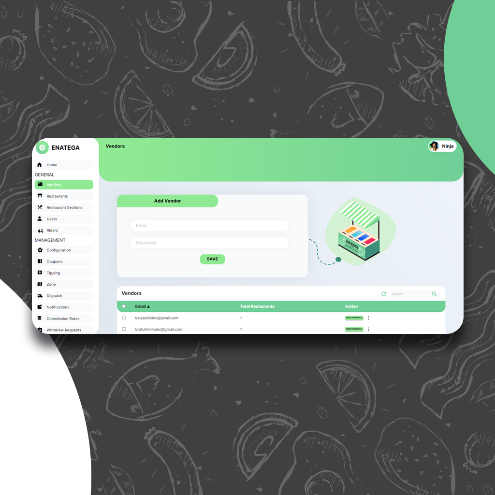 | 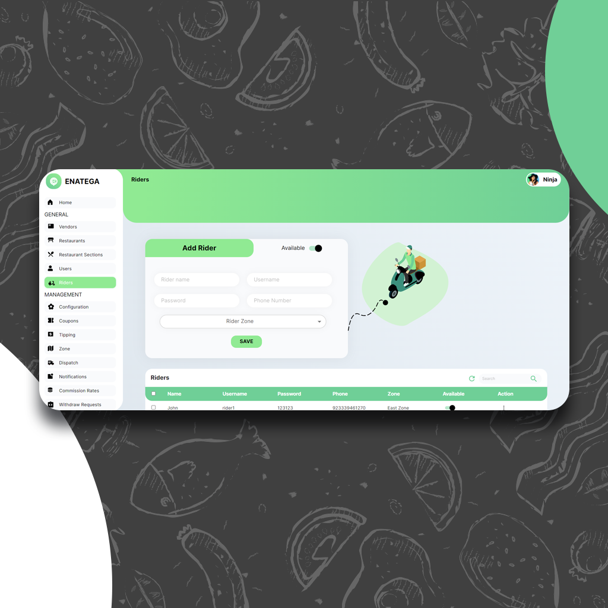 | 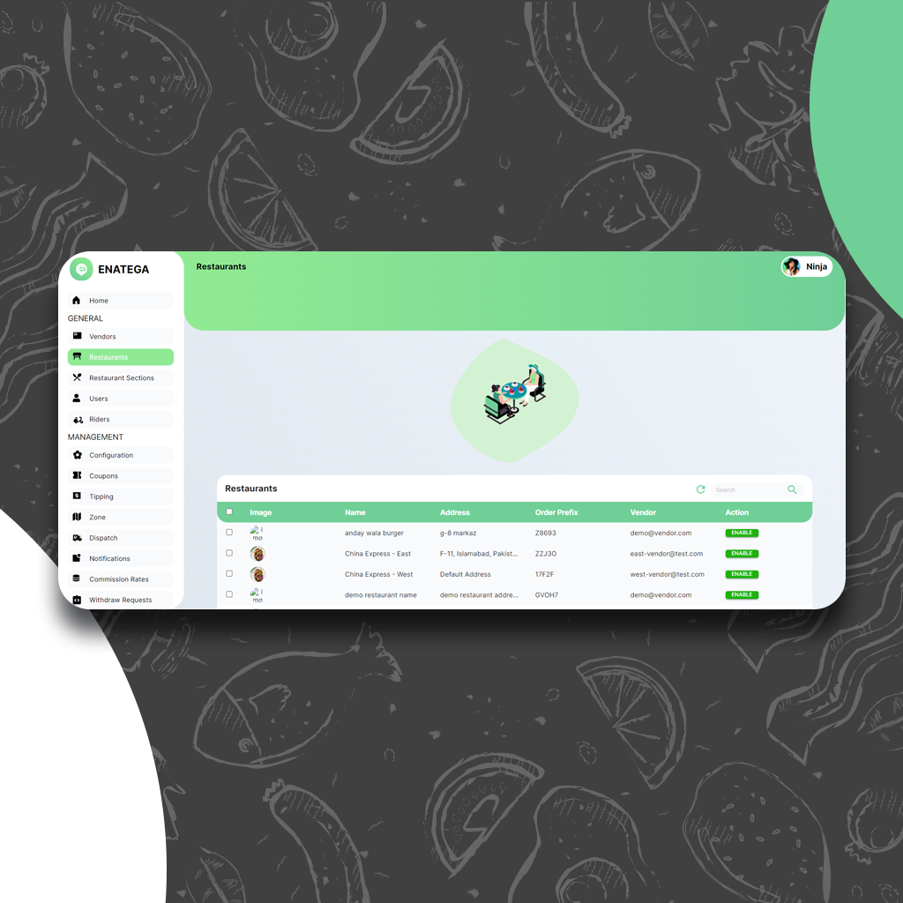  |

|     Customer Web Homepage      |    Customer Web Restaurants    |      Customer Web Profile      |
| :----------------------------: | :----------------------------: | :----------------------------: |
|  |  |  |

|        Rider Menu         |    Rider Order Details    |    Rider Items Details    |
| :-----------------------: | :-----------------------: | :-----------------------: |
| 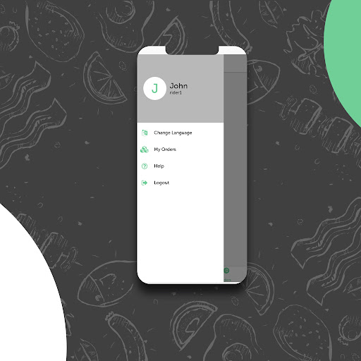 | 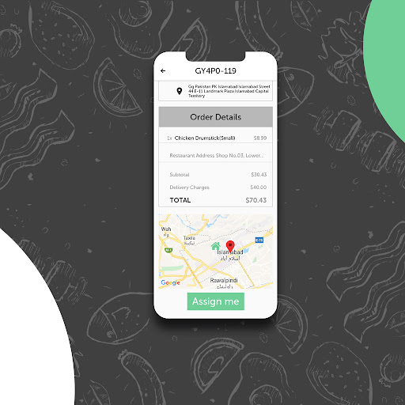 | 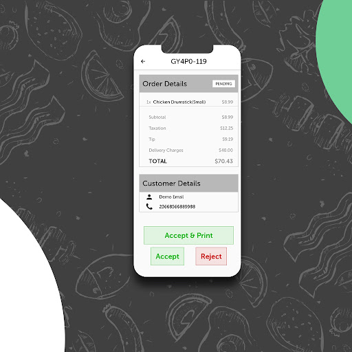 |

|    Customer Order Detail     |    Customer Menu Details     |      Customer Location       |
| :--------------------------: | :--------------------------: | :--------------------------: |
| 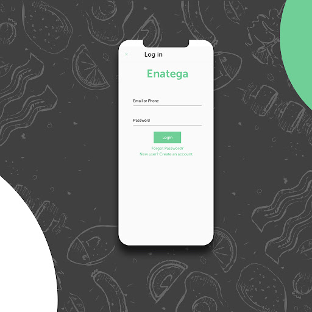 | 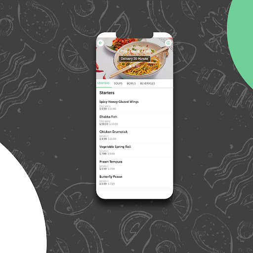 | 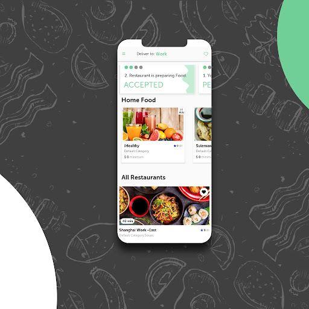 |

|       Restaurant Orders       |        Restaurant Menu         |      Restaurant Delivered      |
| :---------------------------: | :----------------------------: | :----------------------------: |
| 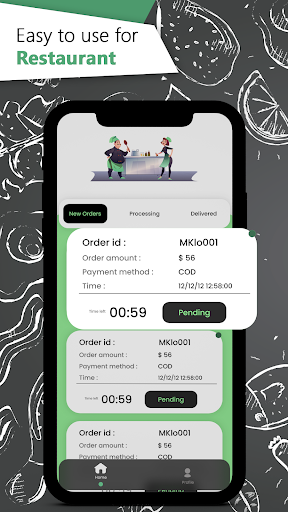 | 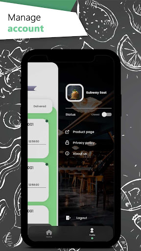 | 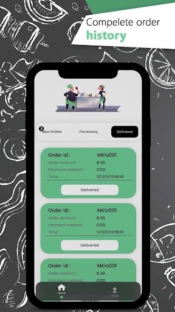 |

|       Web Orders              |        Web Checkout            |      Web Cart                  |
| :---------------------------: | :----------------------------: | :----------------------------: |
|  |  |  |

|      Mobile Restaurant        |        Mobile Location         |      Mobile Cart      |
| :---------------------------: | :----------------------------: | :----------------------------: |
|  |  |  |

|      Customer Restaurant        |        Mobile Location         |
| :---------------------------: | :----------------------------: | 
|  |  |

## High Level Architecture: 

- User Mobile App communicates with both API Server and Amplitudes analytics dashboard
- Web dashboard communicates with only API Server
- Rider App communicates with API Server
- Restaurant App communicates API Server
- Errors are reported to Sentry by Customer App, Restaurant App, Rider App, Web Customer App and API Server

## Documentation and Demo Videos: 

Find the link for the complete documentation of the Enatega Multi Vendor Solution [here](https://enatega-1.gitbook.io/).

To check out video demo of admin dashboard please click [here](https://www.youtube.com/watch?v=18d_POMa8B4&ab_channel=NinjasCode)

To check out video demo of mobile applications please click [here](https://www.youtube.com/watch?v=2HdHS2I-p6g&ab_channel=NinjasCode)

## Demos: 

- [Customer App Android](https://play.google.com/store/apps/details?id=com.enatega.multivendor)
- [Customer App iOS](https://apps.apple.com/pk/app/enatega-multivendor/id1526488093)
- [Rider App Android](https://play.google.com/store/apps/details?id=com.enatega.multirider)
- [Rider App iOS](https://apps.apple.com/pk/app/enatega-mulitvendor-rider/id1526674511)
- [Restaurant App Android](https://play.google.com/store/apps/details?id=multivendor.enatega.restaurant)
- [Restaurant App iOS](https://apps.apple.com/pk/app/enatega-multivendor-restaurant/id1526672537)
- [Customer Web App](https://multivendor-enatega.ninjascode.com/)
- [Admin Dashboard](https://multivendor-admin.ninjascode.com/)

## Contributing: 

Enatega Multi-Vendor Solution is an open source project. We welcome contributions of all kinds including documentation, bug fixes, feature requests, and code. Please read our [contributing guide](./contributing/contributing.md) for more information on how you can contribute.

## Star History: 

## Contributors: 

 

## Disclaimer: 

The frontend source code for our solution is completely open source. However, the API and backend is proprietary and can be accessed via a paid license. For further information, contact us on the channels provided below.

## Contact Us: 

sales@ninjascode.com
