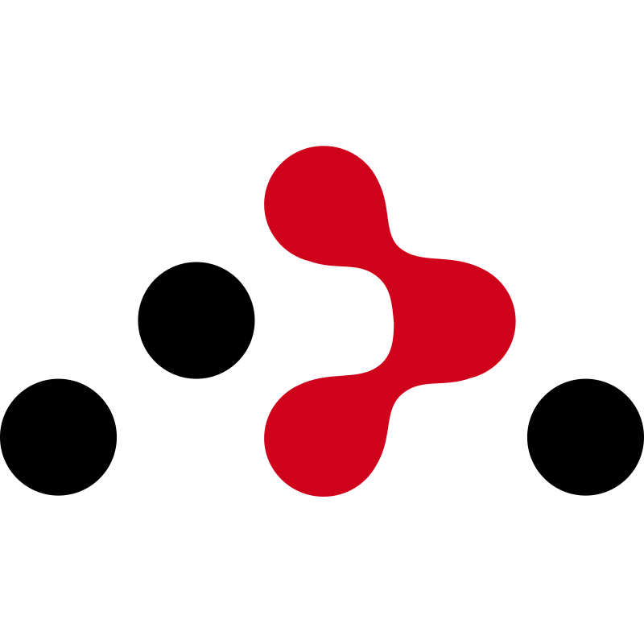
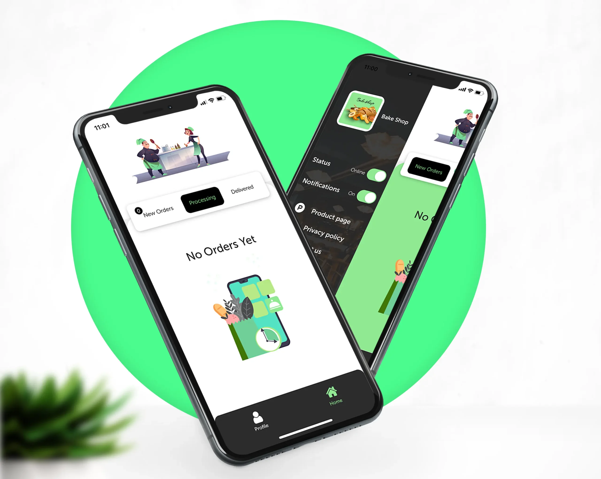
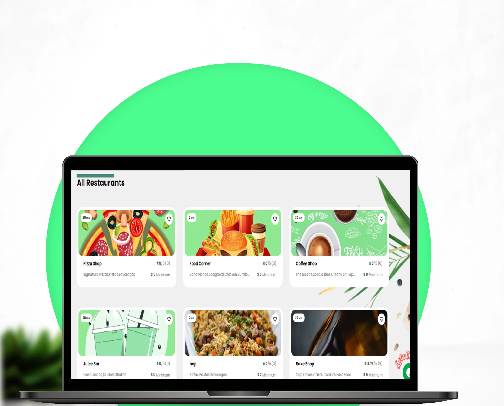
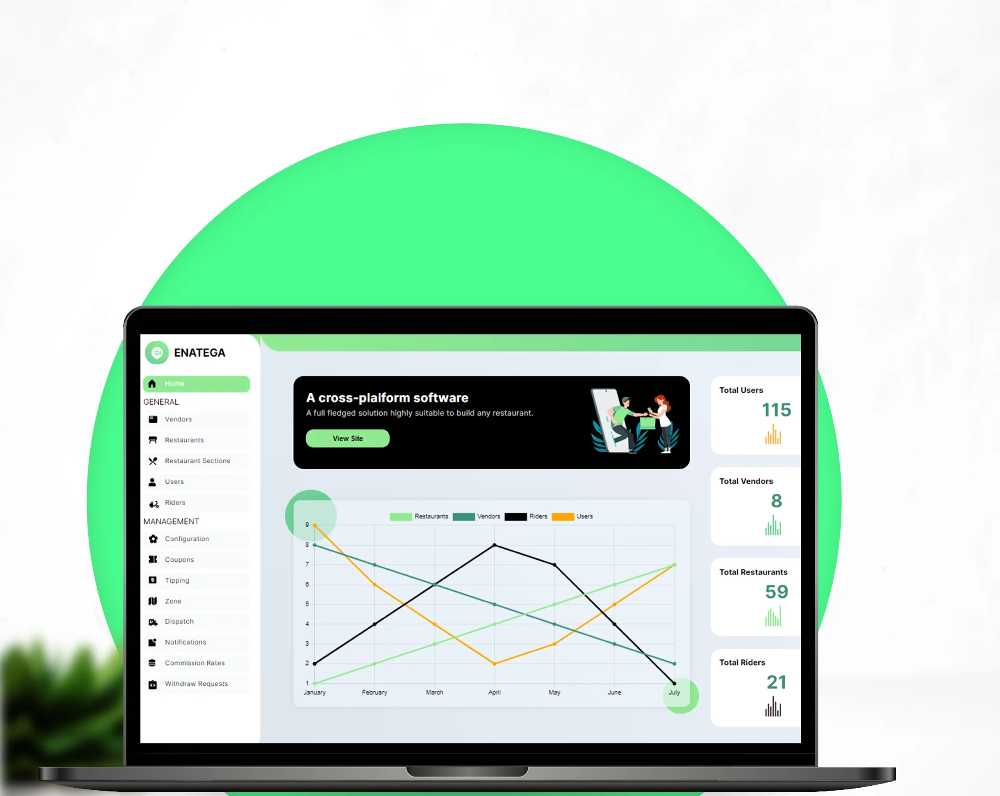
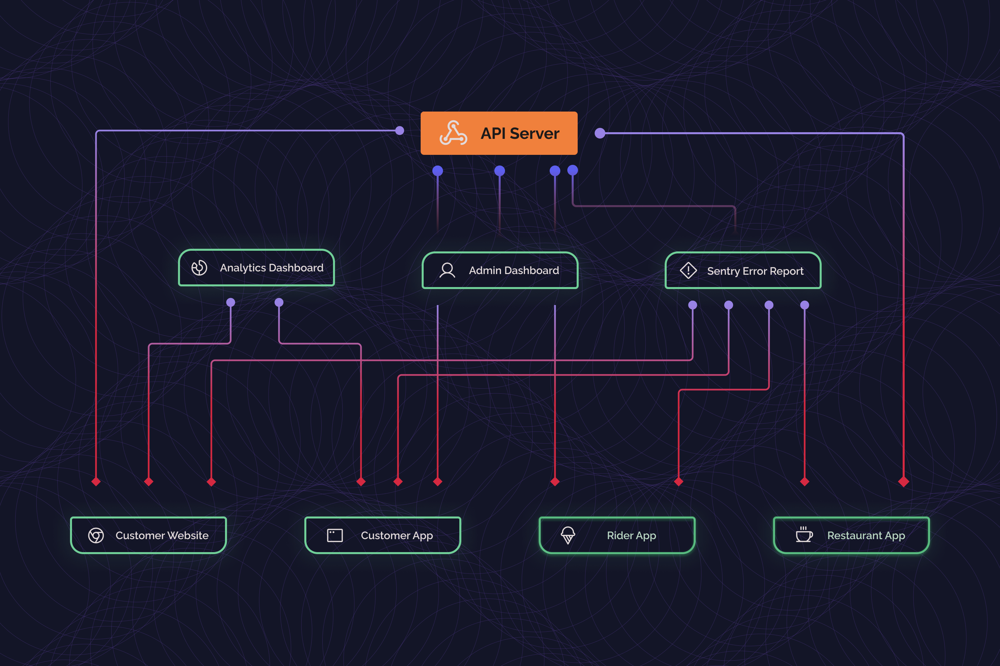

  <h2>Enatega Multi Vendor Food Delivery System</h2>
  <i>The food delivery and order management system for the future.</i>
  
 

	

  
  
  
  
  
  
  
  
  
  

  
  
  
  

  

The Enatega Multi vendor food delivery system is perfect for customers looking to deploy a readymade and easy to use food ordering platform for their own food delivery and logistics business. Just like foodpanda and ubereats, our food delivery system can incorporate multiple restaurants as well as restaurants that operate in multiple locations. With access to the admin panel and separate applications for customers and riders, you can use this solution to create your own online food ordering and order/delivery management system instantaneously.

Our solution is open source but the backend and API are proprietary, and can be obtained via paid license.

<!-- Add a horizontal rule for separation -->

## :fast_forward: Quick Links

- [:book: What is included](#heading-1)
- [:rocket: Features](#heading-2)
- [:wrench: Setup](#heading-3)
- [:gear: Prerequisites](#heading-4)
- [:computer: Technologies](#heading-5)
- [:camera: Screenshots](#heading-6)
- [:triangular_ruler: High Level Architecture](#heading-7)
- [:page_with_curl: Documentation](#heading-8)
- [:movie_camera: Demo Videos](#heading-14)
- [:video_game: Demos](#heading-9)
- [:busts_in_silhouette: Contributors](#heading-10)
- [:warning: Disclaimer](#heading-12)
- [:email: Contact Us](#heading-13)

<!-- Add a horizontal rule for separation -->

## :question: What is included: 

Our food delivery system also comes with the following:

- Enatega Multi vendor Customer App
- Enatega Multi vendor Rider App
- Enatega Multi vendor Restaurant App
- Customer Food Ordering Website
- Admin Web Dashboard
- Application ProgramInterface Server
- Analytics Dashboard with Expo Amplitude
- Error crash reporting with Sentry

## :fire: Features: 

- Authentication using Google, Apple, and Facebook
- Different sections feature for promoting restaurants
- Push notifications and Emails to Users for account creation and order status changes
- Real-time tracking of Rider and chat with Rider option
- Email and Phone number verification
- Location-based restaurants shown on Map and Home Screen
- Multi-Language and different themes support
- Rating and Review features for order
- Details of restaurants include ratings and reviews, opening and closing timings, delivery timings, restaurant menu and items, restaurant location, minimum order
- Payment Integration for both PayPal and Stripe
- Previous order history and adding favorite restaurants
- Adding address with Google Places suggestions and Maps integration
- Analytics and Error reporting with Amplitude and Sentry
- Options to add different variations of food items and adding notes to restaurant
  Pick up and delivery option with different timings

## :repeat_one: Setup: 

As we’ve mentioned above, the solution includes five separate modules. To setup these modules, follow the steps below:

To run the module, you need to have nodejs installed on your machine. Once nodejs is installed, go to the directory and enter the following commands

The required credentials and keys have been set already. You can setup your own keys and credentials

The version of nodejs should be between 14.0 to 16.0

## :information_source: Prerequisites: 

App Ids for Mobile App in app.json

- Facebook Scheme
- Facebook App Id
- Facebook Display Name
- iOS Client Id Google
- Android Id Google
- Amplitude Api Key
- server url

Set credentials in API in file helpers/config.js and helpers/credentials.js

- Email User Name
- Password For Email
- Mongo User
- Mongo Password
- Mongo DB Name
- Reset Password Link
- Admin User name
- Admin Password
- User Id
- Name

Set credentials in Admin Dashboard in file src/index.js

- Firebase Api Key
- Auth Domain
- Database Url
- Project Id
- Storage Buck
- Messaging Sender Id
- App Id

NOTE: Email provider has been only been tested for gmail accounts

## :hammer_and_wrench: Technologies: 
|  Expo   | React-Navigation | Apollo GraphQL | ReactJS | NodeJS | MongoDB | Firebase | 
|:-------:|:------------:|:--------------:|:-------:|:------:|:-------:|:--------:|
| | | |  |  |  |  | 

|React Native | React Router | GraphQL | ExpressJS | React Strap | Amplitude | 
|:------------:|:------------:|:-------:|:---------:|:-----------:|:---------:|
| |  | |  | |  | 

## :framed_picture: Screenshots: 

|          Rider App       |   
| :----------------------: |
|  | 

|          Restaurant APP        |   
| :----------------------------: | 
|  |

|       Customer  App       |   
| :-----------------------: | 
|  | 

|       Customer  Web       |   
| :-----------------------: | 
|  | 

|        Dashboard          |   
| :-----------------------: | 
|  | 

## :wrench: High Level Architecture: 

## :book: Documentation 

Find the link for the complete documentation of the Enatega Multi Vendor Solution [here](https://enatega.com/multivendor-documentation/).

## :tv: Demo Videos: 
|      Admin Dashboard Demo        |        Mobile App Demo         |
| :---------------------------: | :----------------------------: | 
| | 

## :iphone: Demos: 

|      Customer App             |        Rider App               |      Restaurant App           |          Customer Web        |       Admin Dashboard        |
| :---------------------------: | :----------------------------: | :----------------------------:|:----------------------------:|:----------------------------:|
| | | |  |  |
|   |  |  |

## :people_holding_hands: Contributors: 

 

## :warning: Disclaimer: 

The frontend source code for our solution is completely open source. However, the API and backend is proprietary and can be accessed via a paid license. For further information, contact us on the channels provided below.

## :mailbox_with_mail: Contact Us: 
	
[Check out the Product Page and Pricing and more for Enatega Multivendor Food Delivery Solution](https://enatega.com/?utm_source=github&utm_medium=referral&utm_campaign=github_guide&utm_id=12345678)
